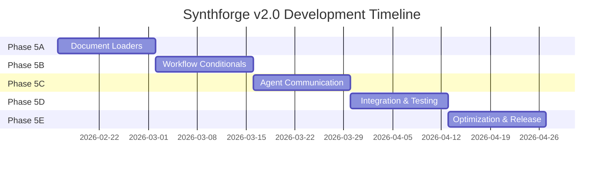

# synthforge Roadmap v2.0 🚀
# synthforge 路線圖 v2.0

**Version**: 2.0  
**Last Updated**: 2026-02-02  
**Status**: v1.1.2 - Task Management Integrated  
**Strategic Focus**: LangChain Ecosystem Integration & Advanced Intelligence

---

## 🎯 Vision Statement / 願景宣言

Transform synthforge from a **Development Automation Platform** into an **Intelligent Development Ecosystem** by integrating the best practices from LangChain, LangGraph, and Multi-Agent Frameworks.

將 synthforge 從**開發自動化平台**轉型為**智能開發生態系統**，整合 LangChain、LangGraph 和多智能體框架的最佳實踐。

---

## 📊 Strategic Overview / 戰略總覽

| Phase | Focus Area | Timeline | Status |
|:---:|---|:---:|:---:|
| **Phase 1-3** | Foundation & Core Features | ✅ Complete | 2026-01-28 ~ 02-01 |
| **Phase 4** | Production Readiness | 🟡 In Progress | 2026-02-02 ~ 02-15 |
| **Phase 5** | Intelligence Evolution | 🔵 Next | 2026-02-16 ~ 03-31 |
| **Phase 6** | Ecosystem Maturity | 🔘 Planned | 2026-04-01 ~ 06-30 |

---

## 🛤️ Five Strategic Development Paths / 五大戰略發展路線

### Path A: 「輕量借鏡」Lightweight Inspiration
**Goal**: Learn design patterns without adding dependencies  
**目標**: 學習設計模式而不增加依賴

#### Milestones
- **M1** (Week 1-2): LangGraph State Machine Analysis
  - Study LangGraph's state graph architecture
  - Document conditional edges and cycles patterns
  - Create design proposal for Workflow v2.0

- **M2** (Week 3-4): MAF Communication Protocol Research
  - Analyze AutoGen and CrewAI message passing
  - Design lightweight protocol for `agents/communication/`
  - Implement PoC with Planner ↔ Executor

- **M3** (Week 5-6): Prompt Engineering Framework
  - Extract best practices from LangChain Hub
  - Create `workflows/prompts/` library
  - Implement ReAct and CoT templates

#### Deliverables
- ✅ Design documents in `.internal/research/`
- ✅ Prototype implementations in `experiments/`
- ✅ Zero new dependencies

---

### Path B: 「文件處理專精」Document Processing Excellence
**Goal**: Enable AI to read and process external documents  
**目標**: 讓 AI 能夠讀取和處理外部文件

#### Milestones
- **M1** (Week 1): Setup Integration Layer
  ```bash
  pip install langchain-core langchain-community
  ```
  - Create `skills/integration/` structure
  - Implement `DocumentSkill` base class

- **M2** (Week 2): Core Loaders
  - PDF Loader (PyPDF2 + LangChain)
  - Web Scraper (BeautifulSoup + LangChain)
  - Excel/CSV Loader

- **M3** (Week 3): Text Processing
  - Implement `RecursiveCharacterTextSplitter`
  - Add code-aware splitting (Python, JS, etc.)
  - Create chunking strategies for different doc types

- **M4** (Week 4): Integration & Testing
  - CLI command: `python devtools/cli.py doc load <file>`
  - Use case: Load spec.pdf → Generate implementation plan
  - Full test coverage

#### Deliverables
- ✅ `skills/integration/document_skill.py`
- ✅ Support for PDF, Web, Excel, Markdown
- ✅ CLI integration
- ✅ 10+ unit tests

---

### Path C: 「狀態機革命」State Machine Revolution
**Goal**: Transform Workflow engine with conditional logic  
**目標**: 用條件邏輯改造 Workflow 引擎

#### Milestones
- **M1** (Week 1-2): Architecture Design
  - Design state graph data structure
  - Define YAML v2.0 schema
  - Plan backward compatibility strategy

- **M2** (Week 3-4): Core Implementation
  - Create `workflows/engine_v2/state_graph.py`
  - Implement conditional edges
  - Add basic cycle detection

- **M3** (Week 5-6): Advanced Features
  - Checkpoint system (`workflows/engine_v2/checkpoint.py`)
  - State persistence to `.internal/checkpoints/`
  - Resume from checkpoint

- **M4** (Week 7-8): Migration & Testing
  - Convert `feature_development.yml` to v2.0
  - Create migration guide
  - Performance benchmarking

#### Deliverables
- ✅ Workflow Engine v2.0
- ✅ YAML v2.0 specification
- ✅ Checkpoint/Resume capability
- ✅ Backward compatible with v1.0

---

### Path D: 「多智能體協作」Multi-Agent Collaboration
**Goal**: Enable true agent-to-agent communication  
**目標**: 實現真正的智能體間通訊

#### Milestones
- **M1** (Week 1-2): Communication Infrastructure
  - Design message protocol
  - Implement `agents/communication/message_bus.py`
  - Create message routing logic

- **M2** (Week 3-4): Agent Upgrades
  - Upgrade Planner to send queries
  - Upgrade Executor to report progress
  - Upgrade Reviewer to send feedback

- **M3** (Week 5-6): Collaboration Patterns
  - **Sequential**: Plan → Execute → Review
  - **Debate**: Multiple Reviewers discuss
  - **Hierarchical**: Planner coordinates multiple Executors

- **M4** (Week 7-8): Safety & Monitoring
  - Implement timeout mechanisms
  - Add message logging
  - Create debugging dashboard

#### Deliverables
- ✅ Message Bus system
- ✅ 3 collaboration patterns
- ✅ Agent communication protocol v1.0
- ✅ Monitoring & debugging tools

---

### Path E: 「混合戰略」Hybrid Strategy ⭐ RECOMMENDED
**Goal**: Balanced integration with phased rollout  
**目標**: 分階段平衡整合

#### Phase 5A: Quick Wins (Week 1-2)
- Implement Document Loaders (from Path B)
- Research LangGraph patterns (from Path A)
- **Deliverable**: AI can read PDF specs

#### Phase 5B: Workflow Intelligence (Week 3-4)
- Implement basic conditional branches (from Path C)
- Support `if-then-else` in YAML
- **Deliverable**: Workflows can retry on failure

#### Phase 5C: Agent Communication (Week 5-6)
- Implement simple Message Bus (from Path D)
- Enable Planner ↔ Executor dialogue
- **Deliverable**: Agents can ask questions

#### Phase 5D: Integration (Week 7-8)
- Combine all three modules
- End-to-end testing
- Documentation update
- **Deliverable**: Fully integrated system

#### Phase 5E: Optimization (Week 9-10)
- Performance tuning
- User feedback incorporation
- Production deployment
- **Deliverable**: v2.0.0 Release

---

## 🎯 Recommended Path Selection Matrix

| Your Priority | Recommended Path | Reason |
|--------------|------------------|--------|
| **Fast ROI** | Path B (Document Processing) | Immediate value, low risk |
| **Long-term Vision** | Path E (Hybrid) ⭐ | Balanced, comprehensive |
| **Innovation** | Path C (State Machine) | Cutting-edge workflow engine |
| **Team Collaboration** | Path D (Multi-Agent) | Enable complex projects |
| **Zero Dependencies** | Path A (Lightweight) | Full control, no external libs |

---

## 📈 Success Metrics / 成功指標

### Phase 5 KPIs
- **Development Speed**: 30% faster feature implementation
- **Code Quality**: 90%+ test coverage
- **Agent Autonomy**: 50% reduction in human intervention
- **System Reliability**: 99% uptime for critical workflows

### Phase 6 KPIs
- **Community Adoption**: 100+ GitHub stars
- **Plugin Ecosystem**: 10+ community-contributed skills
- **Enterprise Readiness**: SOC2 compliance
- **AI Performance**: GPT-4 level reasoning in specialized domains

---

## 🗓️ Detailed Timeline (Path E - Hybrid Strategy)



---

## 🚀 Immediate Next Steps (This Week)

### If choosing Path E (Hybrid)
1. **Day 1-2**: Install `langchain-core` and `langchain-community`
2. **Day 3-4**: Create `skills/integration/document_skill.py`
3. **Day 5**: Implement PDF loader
4. **Day 6-7**: Write tests and documentation

### Task Checklist
- [ ] Update `task.md` with Phase 5A milestones
- [ ] Create `skills/integration/` directory
- [ ] Install dependencies
- [ ] Implement first Document Loader
- [ ] Write integration tests
- [ ] Update ARCHITECTURE.md to reflect new components

---

## 🔗 Related Documents

- [Integration Strategy](file:///c:/Users/xx8897/.gemini/antigravity/brain/d92ecf9d-b022-4416-8dfb-77b91f67f657/integration_strategy.md)
- [ARCHITECTURE.md](file:///c:/Users/xx8897/synthforge/docs/architecture/ARCHITECTURE.md)
- [VIBE_GUIDE.md](file:///c:/Users/xx8897/synthforge/VIBE_GUIDE.md)
- [Task Management Rule](file:///c:/Users/xx8897/synthforge/rules/management/TASK_MANAGEMENT_RULE.md)

---

## 📝 Version History

| Version | Date | Changes |
|---------|------|---------|
| 1.0 | 2026-02-01 | Initial roadmap with Phases 1-4 |
| 2.0 | 2026-02-02 | Added 5 strategic paths with LangChain integration |

---

**Last Updated**: 2026-02-02  
**Status**: v1.1.2 (Task Management Integrated)  
**Next Milestone**: Phase 5A - Document Processing (Week 1-2)  
**Maintainer**: xx8897
