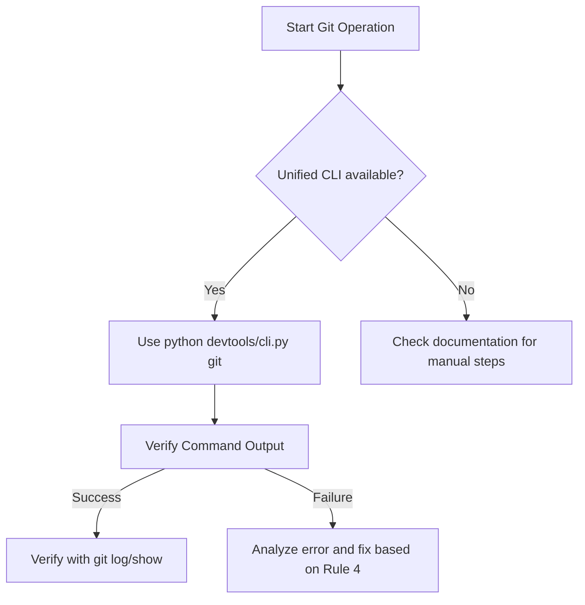

# GIT_EXECUTION_RULE - Standard for Git Operations
# GIT_EXECUTION_RULE - Git 操作執行標準

**Status**: MANDATORY  
**Priority**: CRITICAL (10/10)  
**Version**: 1.0  

---

## 🎯 Purpose / 目的

Prevent AI agents from making errors during Git command construction and execution. Ensure every Git operation is verified and follows the project's semantic and branch standards.

防止 AI 代理在構建和執行 Git 命令時出錯。確保每個 Git 操作都經過驗證，並遵循專案的語義和分支標準。

---

## 📋 Execution standards / 執行標準

### 1. Command Construction / 命令構建
- **ALWAYS** use the unified CLI (`python devtools/cli.py git ...`) for commits and pushes.
- **NEVER** assume a commit succeeded without checking the output for the `✅ Committed` signature.
- **ALWAYS** include the `-a` (auto-stage) or specify files to avoid empty commits.

### 2. Smart Usage / 智慧使用
- **PRIORITIZE** using the `-s` (smart) flag to allow the `SmartGitHandler` and `SummarySkill` to generate context-aware messages.
- **CROSS-CHECK**: Before executing a smart commit, read the latest `task.md` or session summary to ensure the suggested message aligns with current progress.

### 3. Verification Protocol / 驗證通訊協定
After any Git command, the agent MUST:
1.  Check the return code and terminal output.
2.  If it's a commit: Run `git log -1` to verify the entry exists.
3.  If it's a tag: Run `git show <tag>` to ensure it points to the correct commit.

### 4. Failure Handling / 失敗處理
- If a command fails with `fatal: tag ... already exists`, the agent MUST check if the tag needs to be moved (`git tag -d` then re-add).
- If a commit fails due to "nothing to commit", the agent SHOULD check if files were truly modified or if they need to be added manually.

---

## 🧭 Decision Tree / 決策樹

---

**Last Updated**: 2026-02-02  
**Maintainer**: xx8897
