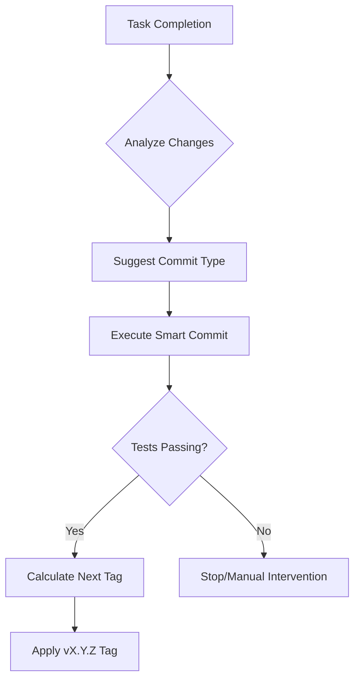

# SMART_GIT_RULE - Smart Git Automation Standards
# SMART_GIT_RULE - 智慧 Git 自動化標準

**Status**: MANDATORY  
**Priority**: HIGH (8/10)  
**Version**: 1.0  

---

## 🎯 Purpose / 目的

Define the standards for automated Git operations, including intelligent commit message suggestion and automatic semantic version tagging.

定義自動化 Git 操作的標準，包括智慧提交訊息建議和自動語義版本標籤。

---

## 📋 Core Rules / 核心規則

### 1. Semantic Versioning (SemVer) / 語義版本控制
- **MAJOR (x.0.0)**: Triggered by breaking changes or manual override.
- **MINOR (0.x.0)**: Triggered by `feat:` or `refactor:` commits.
- **PATCH (0.0.x)**: Triggered by `fix:`, `docs:`, `test:`, or `chore:` commits.

---

### 2. Intelligent Commit Suggestions / 智慧提交建議
Automated commit suggestions must analyze the staged changes:
- If only `.md` files: Suggest `docs:`.
- If only `tests/`: Suggest `test:`.
- If `core_lib/` or `agents/`: Suggest `feat:` or `refactor:`.
- If `requirements.txt` or `setup.py`: Suggest `chore:`.

---

### 3. Automatic Tagging / 自動標籤
- Tags must follow the `vX.Y.Z` format.
- Automated tagging should skip if the workspace is in an "Unstable" state (e.g., tests failing).
- Each tag must include a brief summary of changes in the annotation.

---

### 4. Frequency & Safety / 頻率與安全
- **Auto-Commit**: Should be triggered after completion of a task.md item.
- **Verification**: Tests MUST pass before an automated Version Tag is applied.
- **Privacy**: Automated handlers MUST check for sensitive info (API keys) before committing (leverage `devtools/security/`).

---

## 🔄 Workflow Integration / 工作流整合

---

## 📝 Implementation Notes
- Use `git rev-list --tags --max-count=1` to find the last tag.
- Analyze `git log <last_tag>..HEAD` to determine the increment type.
- Default behavior: Increment Patch unless a `feat:` is found.

---

**Last Updated**: 2026-02-02  
**Maintainer**: xx8897
